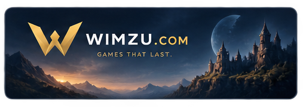

  

  
<strong>Niezależne studio gier mobilnych i cyfrowej rozrywki.</strong>

  <a href="https://github.com/Wimzu-com?tab=repositories">Repozytoria</a>

---

<table>
  <tr>
    <td width="68%" valign="top">
      <h2>Wimzu</h2>
      

        Tworzymy wciągające gry mobilne, które łączą dopracowaną jakość,
        świeże pomysły i zrównoważoną strategię rozwoju.
      

      

        Naszym celem jest tworzenie gier, które dają satysfakcję od pierwszej
        sesji i zostają z graczami na długo.
      

    </td>
    <td width="32%" align="center">
      
    </td>
  </tr>
</table>

## Na czym się skupiamy

- czytelna i satysfakcjonująca rozgrywka,
- spójna oprawa oraz dbałość o detale,
- rozwój oparty na testach i opinii graczy,
- regularny rozwój także po premierze.

## Produkcja

**Game design** · **Mobile development** · **2D/3D art** · **QA** · **Analytics** · **Live ops**

 

  
   
  Wimzu.com · Games that last.

