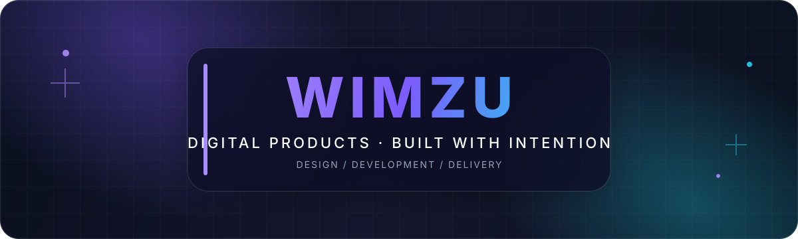

  

   
   

  
  

## Cześć, jesteśmy Wimzu 👋

Projektujemy i rozwijamy **nowoczesne produkty cyfrowe** — od przejrzystych interfejsów, przez stabilne zaplecze, aż po automatyczne wdrożenia. Łączymy estetykę, użyteczność i solidny kod, aby pomysły zmieniały się w rozwiązania, z których chce się korzystać.

### Co tworzymy

<table>
  <tr>
    <td width="33%" valign="top">
      <h3>✦ Aplikacje webowe</h3>
      
Szybkie, responsywne i dopasowane do realnych potrzeb użytkowników.

    </td>
    <td width="33%" valign="top">
      <h3>✦ Serwisy i landing pages</h3>
      
Dopracowane wizualnie strony, które czytelnie opowiadają o produkcie.

    </td>
    <td width="33%" valign="top">
      <h3>✦ Narzędzia i automatyzacje</h3>
      
Rozwiązania upraszczające codzienną pracę i porządkujące procesy.

    </td>
  </tr>
</table>

## Nasz warsztat

Dobieramy technologię do problemu, nie odwrotnie. Najczęściej pracujemy z:

**Frontend**

**Backend i dane**

**Dostarczenie i jakość**

## Jak pracujemy

- **Najpierw cel** — zaczynamy od problemu i wartości dla użytkownika.
- **Prosto i czytelnie** — w interfejsie, architekturze oraz komunikacji.
- **Jakość od początku** — dbamy o wydajność, dostępność i łatwe utrzymanie.
- **Małe kroki, częste wdrożenia** — szybko weryfikujemy pomysły i rozwijamy to, co działa.

---

  <h3>Pomysł jest początkiem. My pomagamy dowieźć resztę.</h3>
  

    Zajrzyj do naszych repozytoriów i obserwuj, co właśnie budujemy.
  

  <a href="https://github.com/Wimzu-com?tab=repositories"><strong>github.com/Wimzu-com →</strong></a>
   
   
  Made with care by Wimzu.com

